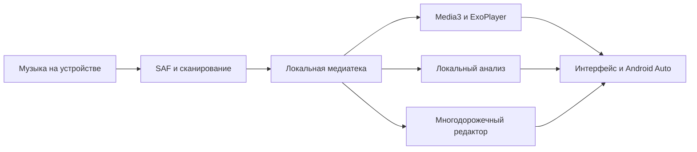
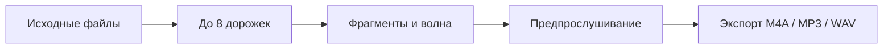
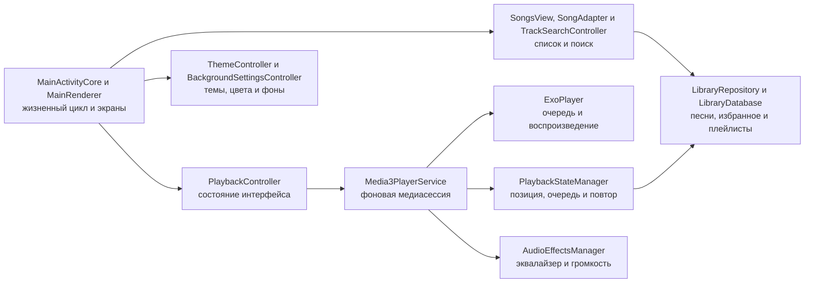
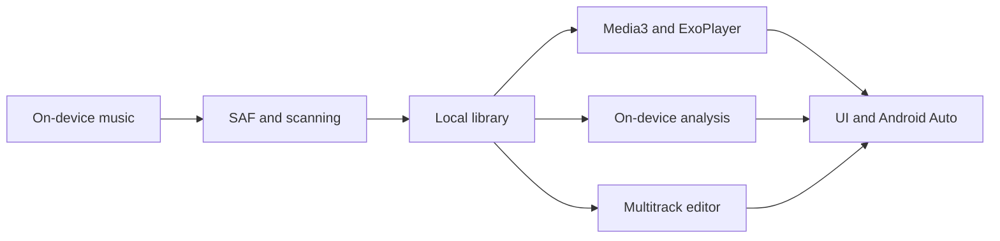
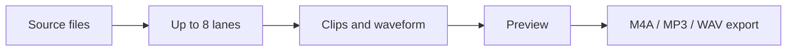
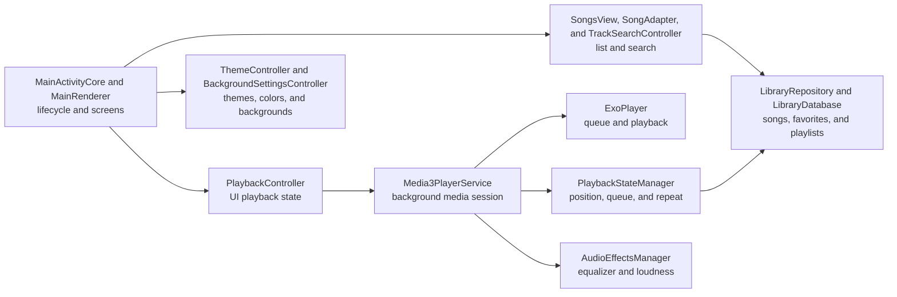

<a id="russian"></a>

<p align="center">
  
</p>

<h1 align="center">Voltunizator — аудиоплеер и редактор</h1>

<p align="center">
  <strong>Ваша музыка. Ваши правила. Никаких аккаунтов и подписок.</strong>
</p>

<p align="center">
  Локальный музыкальный плеер и многодорожечный аудиоредактор для Android. Музыка и обработка остаются на телефоне.
</p>

<p align="center">
  <a href="../../releases/latest/download/MP3-Player-Voltune.apk">
    
  </a>
  <a href="#english">
    
  </a>
</p>

<p align="center">
  
  
  
</p>

Voltunizator превращает музыку на телефоне в личную медиатеку. Приложение находит треки, продолжает играть в фоне, помнит очередь и позицию, а внешний вид можно настроить под себя. Для прослушивания не нужны интернет, регистрация или облачный сервис.

**Версия 4.3.4.** Разнообразные пересоздаваемые очереди, меньше одиночных тематических альбомов, задержка между песнями до пяти минут и вращение обложек без изменения масштаба и обрезания.

<a id="screenshots"></a>
<p align="center"><br><em>Главная и быстрые очереди</em></p>

Снимки интерфейса ниже сделаны в версии 4.2.0 с 165 MP3 из личной медиатеки автора; аудиофайлы в репозиторий не включены.



Медиатека остаётся общей основой плеера, поиска, тематических альбомов, плейлистов и редактора. Обработка пользовательского аудио выполняется на устройстве.

**Разделы:** [Скриншоты](#screenshots) · [Медиатека](#library-ru) · [Плеер](#playback-ru) · [Редактор](#editor-ru) · [Архитектура](#architecture-ru) · [Сборка](#build-ru)

## Почему Voltunizator

| Преимущество | Что получает пользователь |
| --- | --- |
| **Музыка без ограничений** | Все функции бесплатны, нет подписки и закрытых возможностей. |
| **Надёжное воспроизведение** | Media3, фоновый сервис, восстановление очереди, повтор песни или списка и таймер сна. |
| **Личная медиатека** | Импорт отдельных файлов, нескольких песен или целой папки через безопасный системный выбор Android. |
| **Интерфейс под себя** | Темы, цвета, фоны, прозрачность карточек, частицы и вращающиеся обложки. |
| **Быстрая работа** | `RecyclerView`, фоновая загрузка библиотеки, кэш обложек и поиск без блокировки интерфейса. |
| **Телефон и планшет** | Макет автоматически адаптируется к размеру экрана без отдельной настройки. |

<a id="library-ru"></a>
## Большая библиотека остаётся удобной

### Песни

Песни, избранное, плейлисты, тематические альбомы, жанры, исполнители и альбомы собраны в понятные разделы. Доступны поиск, сортировка, случайное и последовательное воспроизведение, ручная очередь и добавление треков в коллекции. Даже большая медиатека открывается без создания тысяч невидимых карточек.

На главном экране удержание кнопки очереди открывает выбор режима: случайные или похожие песни, недавно прослушанные либо давно не включавшиеся. Короткое нажатие создаёт новую очередь, а счётчик рядом задаёт количество песен. Выбор режима сохраняется; очереди по истории разнообразны и учитывают давность прослушивания. В настройках можно задать задержку между песнями от 0 секунд до 5 минут.

<p align="center"><br><em>Песни и медиатека</em></p>

### Плейлисты

Плейлисты помогают собрать собственные подборки и быстро запускать их целиком.

<p align="center"><br><em>Плейлисты</em></p>

### Тематические альбомы

Вкладка «Тематические альбомы» локально анализирует звучание и адаптивно объединяет близкие треки по энергии, динамике, спектру и тембру. BPM не влияет на расстояние, состав или название групп. Аудио и профили не отправляются в интернет.

<p align="center"><br><em>Тематические альбомы</em></p>

### Жанры и поиск

Жанры и исполнители дают привычный способ просмотра медиатеки, а поиск помогает сразу перейти к нужной песне или подборке.

<p align="center"><br><em>Жанры</em></p>

Глобальный поиск охватывает песни и подборки без выхода из медиатеки.

<p align="center"><br><em>Поиск</em></p>


<a id="playback-ru"></a>
## Полный контроль над воспроизведением

Мини-плеер всегда оставляет основные действия под рукой, а большой плеер показывает качественную обложку, живой аудиовизуализатор, прогресс и очередь. Визуализатор получает сигнал непосредственно из Media3 при открытом плеере и не требует доступа к микрофону. Можно перематывать трек, включать повтор песни или всего списка, запускать таймер сна, управлять эквалайзером и добавлять композицию в избранное либо плейлист.

<p align="center"><br><em>Большой плеер и визуализатор</em></p>

Воспроизведение продолжает работать в фоне и управляется из системной медиапанели Android. Очередь, текущая песня, позиция и режим повтора сохраняются, чтобы после возвращения не начинать всё заново.

<p align="center"><br><em>Очередь воспроизведения</em></p>


## Звук и внешний вид под ваш вкус

Voltunizator предлагает эквалайзер с готовыми профилями и собственной сохраняемой конфигурацией. Функция выравнивания громкости анализирует треки и сглаживает заметные перепады между песнями.

Светлая, тёмная и пользовательская темы дополняются двумя акцентными цветами, настройкой текста и контура. Для основного интерфейса и большого плеера можно выбрать однотонный фон, градиент, изображение или GIF, отрегулировать размытие и общую прозрачность карточек. Обложки могут быть скруглёнными, круглыми, шестиугольными, ромбовидными, звёздными или треугольными; вращение включается отдельно для любой формы. Частицы имеют готовые фигуры и редактор собственной формы.

<p align="center"><br><em>Настройки звука и внешнего вида</em></p>


<a id="editor-ru"></a>
## Аудиоредактор



Выберите композицию в библиотеке и откройте редактор через свойства песни либо добавьте аудио внутри редактора. Фрагменты можно обрезать, разделять и переставлять; отдельные дорожки можно приглушить при предпрослушивании. Экспорт создаёт новый файл и не перезаписывает источник.

<p align="center"><br><em>Многодорожечный редактор</em></p>

Раздел «Редактор» после папок позволяет обрезать, делить и соединять фрагменты,
располагать до восьми звуковых дорожек, менять их громкость и слушать монтаж.
Звуковая волна показывает сигнал и положение фрагментов.
Черновик сохраняется, изменения можно отменять. Экспорт доступен в M4A, MP3 и WAV,
исходные аудиофайлы не перезаписываются.

Локальные модели убирают шумы и разделяют музыку на вокал, ударные, бас и остальное.
Удаление вокала создаёт инструментальную дорожку. Обработка требует свободной памяти
и места; на слабых устройствах разделение может занимать значительно больше времени,
чем длится песня. Точность зависит от записи, полная изоляция инструментов не гарантируется.
Модель включена в APK, скачивать её внутри приложения не нужно.
Разделение работает в отдельной службе с уведомлением о прогрессе и отменой, в том числе
после закрытия редактора или выключения экрана. На устройствах с достаточным запасом
памяти и процессорных ядер независимые окна обрабатываются параллельно с прежней моделью.
Результат сохраняется в черновик; незавершённую задачу можно продолжить при входе в редактор.

## Возможности

- Стартовая «Главная» с продолжением прослушивания, историей, новыми и часто слушаемыми треками.
- Локальная вкладка «Тематические альбомы» с адаптивными группами по реальному аудиосигналу без облака.
- Монтаж, предпрослушивание, разделение источников, удаление шумов и экспорт M4A/MP3/WAV.
- Скорость 0,25–4x, три режима выравнивания громкости и затихание в конце трека.
- Короткое нажатие на инструменты большого плеера переключает режим, удержание открывает настройки.
- Живой визуализатор звука в большом плеере без доступа к микрофону и повторного декодирования трека.
- Умные плейлисты, глобальный поиск по пяти категориям и просмотр библиотеки по папкам.
- Очередь Media3 с перетаскиванием, свайпом, «играть следующим» и сохранением в плейлист.
- Локальные `.lrc`, обычные и встроенные ID3-тексты без сетевых запросов.
- Безопасный редактор метаданных библиотеки, не изменяющий байты исходного аудиофайла.
- Виджет рабочего стола и медиатека Android Auto через существующую Media3 session.
- Импорт одной песни, нескольких аудиофайлов или целой папки через Android SAF.
- Воспроизведение локальных аудиоформатов, которые поддерживаются медиадвижком Android Media3 на устройстве.
- Разделы «Песни», «Избранное», «Плейлисты», «Жанры», «Исполнители» и «Альбомы».
- Быстрый поиск, сортировка, очередь и случайное воспроизведение.
- Фоновое воспроизведение и управление из уведомления и системной медиапанели.
- Повтор текущей песни или всей очереди до ручной остановки либо срабатывания таймера.
- Таймер сна, включая остановку после выбранного времени.
- Мини-плеер с настраиваемой памятью и большой плеер со свайпом вниз.
- Редактирование очереди, избранное и пользовательские плейлисты.
- Эквалайзер с пресетами и запоминаемой ручной настройкой.
- Анализ воспринимаемой громкости и плавное выравнивание уровня между треками.
- Светлая, тёмная и полностью настраиваемая тема.
- Однотонные, градиентные, графические и GIF-фоны с регулируемым размытием.
- Настраиваемые цвета, контур текста, формы частиц и общая прозрачность карточек.
- Скруглённые, круглые, шестиугольные, ромбовидные, звёздные и треугольные обложки с отдельной настройкой вращения.
- Интерфейс на русском, английском, испанском, португальском (Бразилия), упрощённом китайском, немецком, французском, хинди, индонезийском, японском, корейском и арабском.
- Автоматическая адаптация интерфейса для планшетов.
- Локальные отчёты о сбоях без сохранения URI и путей к музыкальным файлам.

<a id="architecture-ru"></a>
## Как устроен проект



Основные точки расширения:

| Задача | Файлы |
| --- | --- |
| Списки песен и поиск | `SongsView`, `SongAdapter`, `SongsRenderer`, `TrackSearchController` |
| Импорт и хранение библиотеки | `AudioImportController`, `LibraryRepository`, `LibraryDatabase`, `TrackStore` |
| Воспроизведение и очередь | `PlaybackController`, `Media3PlayerService`, `PlaybackQueueManager` |
| Мини-плеер и большой плеер | `MiniPlayerController`, `FullPlayerController`, `PlayerUiController` |
| Плейлисты и избранное | `PlaylistController`, `PlaylistManager`, `FavoritesMenuRenderer` |
| Темы, фоны и элементы интерфейса | `ThemeController`, `BackgroundSettingsController`, `UiFactory`, `ButtonFactory` |
| Эквалайзер и громкость | `EqualizerController`, `AudioEffectsManager`, `TrackLoudnessNormalizer` |

<a id="build-ru"></a>
## Сборка

Исходники разделены по задачам: `LibraryRepository` хранит медиатеку, `Media3PlayerService` владеет проигрывателем и очередью, `MainRenderer` отображает навигацию, а редактор использует отдельные обработчики и локальную модель. Внешние Media3-контроллеры получают только стандартные возможности управления; внутренние команды и технические поля библиотеки им недоступны.

Требуются JDK 17 и Android SDK:

```bash
git submodule update --init --recursive
./gradlew qualityCheck
```

Команда проверяет лимит 500 строк, архитектурные инварианты, иконку, unit-тесты,
Android lint, debug APK и компиляцию instrumentation-тестов.

Также используются NDK 27.2.12479018 и CMake 3.22.1. Первая сборка скачивает
закреплённую модель HTDemucs (84 МБ) и проверяет SHA-256. Для работы самого приложения
интернет не требуется. Лицензии сторонних библиотек и модели включены в APK.

Официальная release-сборка подписывается закрытым ключом через GitHub Actions. Готовый APK публикуется только в [GitHub Releases](../../releases/latest).

## Лицензия

Исходный код доступен для личного, образовательного и некоммерческого использования. Коммерческое применение требует разрешения автора. Это source-available проект с некоммерческой лицензией, а не лицензия OSI Open Source.

## Автор

Автор проекта **Зейналов У. Р. о.**

[Репозиторий Voltunizator](https://github.com/dumuzeyn/Voltunizator)

[Поддержать автора через CloudTips](https://pay.cloudtips.ru/p/54e5a4f9). Поддержка является добровольной и безвозмездной, не открывает подписку, дополнительные функции или другие преимущества.

---

<a id="english"></a>

<p align="center">
  
</p>

<h1 align="center">Voltunizator — audio player and editor</h1>

<p align="center">
  <strong>Your music. Your rules. No accounts or subscriptions.</strong>
</p>

<p align="center">
  A polished local music player for Android, built around the collection already stored on your device.
</p>

<p align="center">
  <a href="../../releases/latest/download/MP3-Player-Voltune.apk">
    
  </a>
  <a href="#russian">
    
  </a>
</p>

<p align="center">
  
  
  
</p>

Voltunizator turns locally stored music into a personal library. It finds tracks quickly, keeps playing in the background, remembers the queue and position, and offers visual customization. Playback requires no internet connection, account, or cloud service. Screenshots appear beside the features they show.

**Version 4.3.4.** More varied regenerated queues, fewer single-song thematic albums, an inter-track delay up to five minutes and constant-scale cover rotation without clipping.

<a id="screenshots-en"></a>
<p align="center"><br><em>Home and quick queues</em></p>

These interface screenshots were captured in version 4.2.0 with 165 MP3s from a personal library. The audio files are not included in this repository.



The library is the shared foundation for playback, search, thematic albums, playlists, and editing. User audio is processed on the device.

**Sections:** [Screenshots](#screenshots-en) · [Library](#library-en) · [Player](#playback-en) · [Editor](#editor-en) · [Architecture](#architecture-en) · [Build](#build-en)

## Why Voltune

| Advantage | What it means |
| --- | --- |
| **Music without restrictions** | Every feature is free, with no subscription or locked functionality. |
| **Reliable playback** | Media3, a foreground service, queue restoration, repeat-one, repeat-all, and a sleep timer. |
| **Your own library** | Import one file, multiple songs, or an entire folder through Android's secure system picker. |
| **A personal interface** | Themes, colors, backgrounds, card opacity, particles, and rotating artwork. |
| **Responsive with large libraries** | `RecyclerView`, background loading, artwork caching, and non-blocking search. |
| **Phone and tablet ready** | The layout adapts automatically to the available screen size. |

<a id="library-en"></a>
## A large library that stays manageable

### Songs

Songs, Favorites, Playlists, Thematic albums, Genres, Artists, and Albums are organized into focused sections. Search, sorting, shuffle, sequential playback, a manual queue, and collection actions remain close at hand. Large libraries stay responsive because Voltunizator creates only the rows that are actually visible.

Long-press the Home queue button to select random, similar, recent-listening or long-unplayed songs. Tap it to generate a new queue using the adjacent count wheel. The selected mode is remembered; history queues vary while favoring the selected listening recency. Settings include a 0–5 minute delay between songs.

<p align="center"><br><em>Songs and library</em></p>

### Playlists

Playlists let you build your own collections and start one with a single action.

<p align="center"><br><em>Playlists</em></p>

### Thematic albums

The Thematic albums tab analyzes sound locally and adaptively groups nearby tracks by energy, dynamics, spectrum, and timbre. BPM does not affect group distance, membership, or names. Audio and profiles never leave the device.

<p align="center"><br><em>Thematic albums</em></p>

### Genres and search

Genres and artists offer familiar ways to browse the library.

<p align="center"><br><em>Genres</em></p>

Global search covers songs and collections without leaving the library.

<p align="center"><br><em>Search</em></p>


<a id="playback-en"></a>
## Complete playback control

The mini-player keeps essential actions available throughout the app, while the full player presents high-quality artwork, a live audio visualizer, progress, and the current queue. The visualizer reads Media3 playback audio only while the full player is open; it needs no microphone permission. Seek through a track, repeat one song or the complete list, start the sleep timer, open the equalizer, or add the current song to Favorites and playlists.

<p align="center"><br><em>Full player and visualizer</em></p>

Playback continues in the background and integrates with Android system media controls. The queue, current song, position, and repeat mode are preserved so returning to the app does not mean starting over.

<p align="center"><br><em>Playback queue</em></p>


## Sound and appearance made personal

Voltunizator includes an equalizer with built-in presets and a remembered custom profile. Volume leveling analyzes tracks and smooths noticeable loudness differences between songs.

Light, Dark, and Custom themes support two accent colors plus independent text and outline settings. The main interface and full player can use solid colors, gradients, validated images, or GIF backgrounds with adjustable blur and one shared card-opacity control. Artwork may be rounded, circular, hexagonal, diamond-shaped, star-shaped, or triangular; rotation can be enabled for any shape. Particles offer presets and a custom drawing surface.

<p align="center"><br><em>Sound and appearance settings</em></p>


<a id="editor-en"></a>
## Audio editor



Open a song from its properties or add audio in the editor. Trim, split, and move clips; mute individual lanes while previewing. Export creates a new file and does not overwrite the source.

<p align="center"><br><em>Multitrack editor</em></p>

Editor follows Folders and supports trimming, splitting, joining, up to eight mixed
lanes, clip volume, draft restoration, undo/redo and preview. A decoded waveform
provides range selection. Export supports M4A, MP3, and WAV without overwriting original audio files.

Offline models reduce noise and separate drums, bass, other instruments and vocals.
Vocal removal creates an instrumental stem. Separation needs free memory and storage
and can take substantially longer than the song on slower devices. Results depend
on the recording; perfect source isolation is not guaranteed. The APK includes the
model, with no in-app download or upload.
Separation runs in a foreground service with progress and cancellation, including after
the editor closes or the display switches off. Devices with sufficient memory and CPU
cores process independent windows in parallel with the same model. Completed results
are saved in the draft; the editor can resume a pending job when reopened.

## Features

- Home starts with listening continuity, history, recent additions, favorites, and quick access.
- The local Thematic albums tab builds adaptive groups from real audio features without cloud processing.
- Audio editing, preview, source separation, noise reduction, and M4A/MP3/WAV export.
- Playback speed from 0.25x to 4x, three loudness modes and optional end-of-track fade.
- Tap full-player tools to toggle; hold to configure their settings.
- Smart playlists, five-category global search, and safe folder-based browsing.
- A Media3-owned queue with drag, swipe, play-next, append, clear, and save-to-playlist actions.
- Offline sidecar LRC, synchronized lyrics, plain text, and bounded embedded ID3 lyrics.
- Library metadata editing that never mutates the source audio bytes.
- A home-screen widget and Android Auto library backed by the existing Media3 session.
- Import one song, multiple audio files, or a complete folder through Android SAF.
- Play local audio formats supported by Android Media3 on the device.
- Songs, Favorites, Playlists, Genres, Artists, and Albums sections.
- Fast search, sorting, queue management, and shuffle.
- Background playback with notification and Android system media controls.
- Repeat the current song or complete queue until manually stopped or interrupted by the timer.
- Sleep timer with timed playback termination.
- Remembered mini-player and a swipe-down full player.
- Queue editing, Favorites, and user-created playlists.
- Equalizer presets plus a saved manual configuration.
- Per-track loudness analysis and smooth leveling between songs.
- Light, Dark, and fully configurable Custom themes.
- Solid, gradient, image, and GIF backgrounds with adjustable blur.
- Custom colors, text outlines, particle shapes, and shared card opacity.
- Rounded, circular, hexagonal, diamond-shaped, star-shaped, and triangular artwork with independent rotation control.
- Interfaces in Russian, English, Spanish, Brazilian Portuguese, Simplified Chinese, German, French, Hindi, Indonesian, Japanese, Korean, and Arabic.
- Automatic tablet adaptation.
- Local crash reports that do not store music URIs or file paths.

<a id="architecture-en"></a>
## Project architecture



Primary extension points:

| Task | Files |
| --- | --- |
| Song lists and search | `SongsView`, `SongAdapter`, `SongsRenderer`, `TrackSearchController` |
| Library import and storage | `AudioImportController`, `LibraryRepository`, `LibraryDatabase`, `TrackStore` |
| Playback and queue | `PlaybackController`, `Media3PlayerService`, `PlaybackQueueManager` |
| Mini-player and full player | `MiniPlayerController`, `FullPlayerController`, `PlayerUiController` |
| Playlists and favorites | `PlaylistController`, `PlaylistManager`, `FavoritesMenuRenderer` |
| Themes, backgrounds, and UI elements | `ThemeController`, `BackgroundSettingsController`, `UiFactory`, `ButtonFactory` |
| Equalizer and loudness | `EqualizerController`, `AudioEffectsManager`, `TrackLoudnessNormalizer` |

<a id="build-en"></a>
## Build

Responsibilities are separated: `LibraryRepository` maintains the library, `Media3PlayerService` owns playback and the queue, `MainRenderer` displays navigation, and the editor uses dedicated processors plus an on-device model. External Media3 controllers receive standard playback controls only; internal commands and technical library metadata remain private.

JDK 17 and the Android SDK are required:

```bash
git submodule update --init --recursive
./gradlew qualityCheck
```

This gate checks the 500-line limit, architecture invariants, launcher assets, unit tests,
Android lint, the debug APK, and instrumentation-test compilation.

NDK 27.2.12479018 and CMake 3.22.1 are also required. The first build downloads a
pinned HTDemucs model (84 MB) and verifies its SHA-256. The app itself needs no
internet connection. Third-party library and model licenses are bundled in the APK.

Official release builds are signed with a private key through GitHub Actions. Installable APK files are published only through [GitHub Releases](../../releases/latest).

## License

Source code is available for personal, educational, and non-commercial use. Commercial use requires the author's permission. This is a source-available project under a non-commercial license, not an OSI Open Source license.

## Author

Project author: **Zeynalov U. R. o.**

[Voltunizator repository](https://github.com/dumuzeyn/Voltunizator)

[Support the author through CloudTips](https://pay.cloudtips.ru/p/54e5a4f9). Support is voluntary and gratuitous; it does not unlock subscriptions, additional features, or other benefits.
